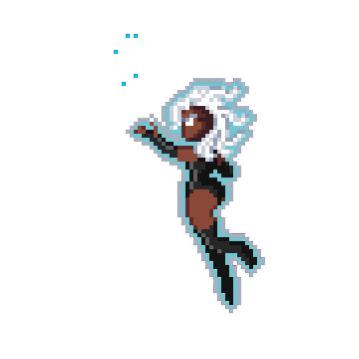

# ❤Oi eu sou a Jake!
Seja bem vindo(a) ao meu perfil.

  

  
 
---
 
Sou estudante de Design e produtos e Ciências Econômicas, e apaixonada por programação, e amante de filmes, quadrinhos, e jogos arcade.
- ❤ Estudante de Design de produtos
- 💙 Estudante de Ciencias Econômicas
- 👩‍💻 Aprendendo algo sobre Programação e prototipação.
  
---

  &nbsp;
  &nbsp;
  &nbsp;
  &nbsp;
  

---

